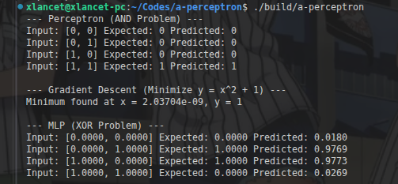

# a-perceptron

Minimal C++ implementations of basic neural network components.

## Features
- **Perceptron**: Solving the AND problem.
- **Gradient Descent**: Minimizing $y = x^2 + 1$.
- **MLP**: Solving the XOR problem.

## Results


## Build & Run
```bash
mkdir build && cd build
cmake ..
make
./a-perceptron
```
